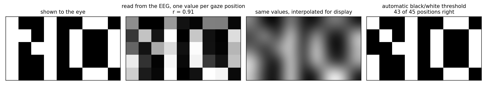
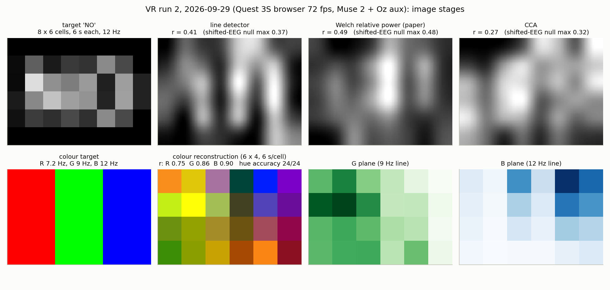
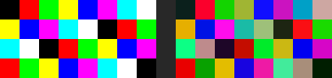
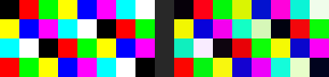
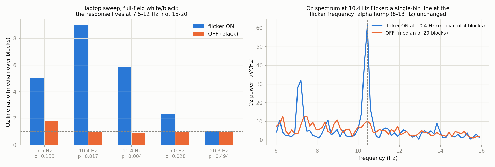
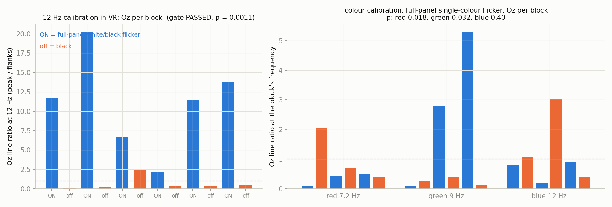
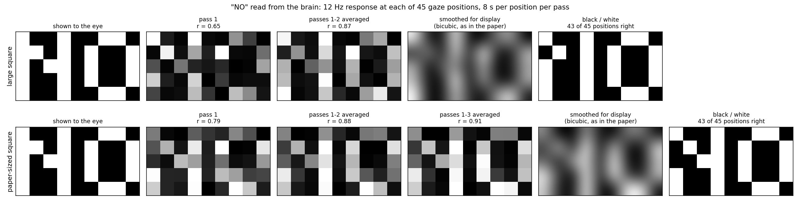

# eyecam: the human eye as a camera

> This branch also contains the **EyeCam web app** (browser version: `start.bat`,
> `server.py`, `web/`). Its instructions are in [README_webapp.md](README_webapp.md).

Reconstructing what a person is looking at from their brainwaves, with a
consumer EEG headband, on a laptop or inside a VR headset.

This is a replication and extension of **Mann et al., "The Human Eye as a
Camera," IEEE HealthCom 2019** ([wearcam.org/eyecam.pdf](http://wearcam.org/eyecam.pdf)),
which grew out of the WearSys'19 abstract *"Eye itself as a camera: Sensors,
integrity, and trust"* (doi 10.1145/3325424.3330210). Work done by MannLab.



**The word "NO", read back from brainwaves.** The subject looked at 45
positions in turn while a square flickered at 12 Hz wherever the picture was
white. The second panel is nothing but the relative strength of the 12 Hz
response in the EEG at each position. It correlates with the picture at **r = 0.91**, and an
automatic black/white threshold, which never sees the picture, gets **43 of
45 positions right**. The same reconstruction from time-shifted EEG reaches at
most r = 0.23.

*Run of 2026-10-01: Quest 3S browser, Muse headband (model MU-02) with an auxiliary
electrode at Oz, 8 s per position, three passes, 18 minutes of scanning. A second run
the same day with a larger square and two passes gave r = 0.87 and again 43 of
45. One subject, one day.*

| after | pass 1 | passes 1-2 | passes 1-3 |
|---|---|---|---|
| correlation with the picture | 0.79 | 0.88 | 0.91 |
| positions right after thresholding | 38 of 45 | 43 of 45 | 43 of 45 |

What made the difference, after a month of images that were only weakly above
chance, was getting four ordinary things right at once:

1. **A picture that is a picture at scan resolution.** A word in a scalable
   font, squeezed onto 48 positions, is a grey blob before any brain is
   involved. The target is now a 4 by 5 pixel font, one position per pixel.
2. **The paper's own scoring.** One spectrum over the whole dwell, power at
   the flicker frequency plus its harmonic, divided by the 14 to 50 Hz power.
3. **No vertical blend.** The paper's Eq. 1 is for overlapping scan lines; on
   discrete positions it only smears rows together.
4. **Repeat passes**, averaged per position.



*Run of 2026-09-29, same setup. Bottom row: a red/green/blue flag shown with
each colour flickering at its own frequency, and the colour image rebuilt from
three spectral lines in the EEG; all 24 cells come back with the right
dominant colour.*

## Everything on one computer (this branch)

This branch needs no phone app. The computer connects to the Muse itself over
Bluetooth, shows the flicker in its own browser, plays any sound from its own
audio output, records, scores and draws the image.

```
pip install -r requirements.txt
python eyecam.py                 # read "NO" from the EEG (about 20 minutes)
python eyecam.py --what full     # image, then colour, then tagged music
python eyecam.py --what alpha    # is the Oz electrode on the scalp?
python eyecam.py --what sweep    # which flicker frequency suits this person?
python eyecam.py --what music    # the 40 Hz tagged music on its own
python eyecam.py --demo          # no hardware: a synthetic subject
```

Turn the headband on, make sure it is **not** connected to MuseLog, Mind
Monitor or any other phone app (a Muse talks to one device at a time), and
run the command. The page opens by itself; click it once and it goes full
screen. `--headset` shows the stimulus in a Quest browser instead,
`--muse Muse-1E3D` picks one headband when several are in range, and
`--phone` falls back to the old path with EEG from a phone app over Wi-Fi.
`python muse_ble.py --scan` lists the headbands the computer can see.

How it works: `muse_ble.py` speaks the headband's Bluetooth LE protocol
directly (one characteristic per electrode, twelve 12-bit samples per packet,
256 samples per second, preset `p20` so the auxiliary Oz input is on) and
writes the same `eeg.csv` the phone path produced, on the same scale. Sample
times are rebuilt from the packet counter, so they are smoother than the
arrival times of Wi-Fi packets.

Status: the packet decoder reproduces MuseLog's logged values exactly, the
sample clock is tested against simulated bursts, drift, lost packets and
stalls, and `--demo` runs the whole chain to an image (r = 0.95 on the
synthetic subject). The live Bluetooth link has **not yet been run against a
real headband**; the results below were recorded through MuseLog.

A 60 Hz screen cannot show 12 Hz exactly; the page picks the nearest
frame-exact rate (10 Hz) and the scoring follows it. A 120, 144 or 240 Hz
screen gives 12 Hz.

## The idea, and the paper behind it

A light that flickers at a steady rate makes visual cortex oscillate at the
same rate. That response, the **steady-state visual evoked potential (SSVEP)**,
shows up in EEG over the back of the head as a narrow spectral line at the
flicker frequency, and it is larger when the flickering patch is brighter.

Mann and colleagues turned that into a camera. A small flickering square is
moved over a scene while the subject follows it with their eyes. At each
position the strength of the EEG line is one pixel. The eye and brain are the
sensor; the picture is assembled from brainwaves alone. The paper used a Muse
headband modified with an extra occipital (Oz) electrode in a 3D-printed
holder, a 100 by 100 pixel square, about 6.7 s per point, 15 Hz flicker (moved
up from 12 Hz to stay clear of the alpha rhythm), a chin rest, and 48
overlapping scan lines blended by a small vertical kernel (their Eq. 1). It
also names the chirplet transform as a future direction for estimating the
evoked response.

The point of the original work is as much about integrity and trust as about
imaging: if the eye itself is the camera, the record of what was seen is tied
to a living observer.

## What this repository adds

- **A complete, gated pipeline** from stimulus to image, with a hardware-free
  synthetic subject as a positive control and shifted-EEG reconstructions as a
  negative control for every result.
- **A browser stimulus that runs anywhere**, including the Meta Quest browser,
  driven by a Python process on a PC. No app install on the headset.
- **A legible grey image on consumer hardware**: the paper's whole-dwell
  power ratio as the pixel value, a pixel-font target, repeat passes, and a
  scan that pauses and redoes a position when the EEG stream drops.
- **An exact-frequency line detector** with an exact permutation test, which is
  about eight times more sensitive than 1 Hz-bin band power and is what first
  found the response on a Muse. It decides the calibration gate; the image
  itself is scored with the paper's ratio.
- **Subject calibration tools**: an electrode check (eyes-closed alpha), a
  frequency sweep that finds where this subject actually responds, and a
  delivery check that voids a run if the flicker was not really on screen.
- **Frequency-tagged colour**: red, green and blue flicker at three different
  frequencies at once, and the three EEG lines become the three colour planes.
- **A 40 Hz-tagged music stage** for the auditory steady-state response
  ("ear as a level meter").
- An honest record of what works and what does not yet.

## What you need

| item | notes |
|---|---|
| Muse 2 / Muse S / Muse Athena | any model that streams raw EEG |
| **Oz auxiliary electrode** | the Interaxon aux cup on micro-USB (Muse 2/S) or USB-C (Athena). This matters: without it we never detected a response. Place it two finger-widths above the bump at the back of the skull, on the midline, hair parted |
| PC with Python 3.10+ and Bluetooth | connects to the Muse, runs the driver and the analysis |
| Phone with Mind Monitor or MuseLog | optional (`--phone`): streams `/muse/eeg` over OSC/UDP, with the aux channel enabled |
| Display | a laptop screen, or a Quest headset on the same Wi-Fi |

```
pip install -r requirements.txt
```

**Safety.** The stimulus is full-contrast flicker between 7 and 20 Hz. Do not
use it with anyone who has photosensitive epilepsy or a history of seizures,
and stop if you feel unwell.

## Try it with no hardware

The phantom subject reads the stimulus log and injects a synthetic response
into the same UDP port a real headband would use, so the whole stack runs
end to end:

```
python gate_test.py                       # offline maths check
python xr_session.py --mode full --session runs/demo --osc-port 5001 --freq 15 \
    --grid-w 6 --grid-h 4 --spc 2 --calib-blocks 5 --calib-on 5 --calib-off 5 \
    --color-freqs 7.5,10,15 --color-grid-w 4 --color-grid-h 3 --color-spc 3
python phantom_subject.py --session runs/demo --port 5001       # second terminal
# then open http://localhost:8082/?auto=1 in a browser
```

## Run it for real

1. Put the Muse on, attach the Oz cup, and start Mind Monitor. Set OSC
   streaming to the PC's IP, port 5000. The driver prints the address to use.
2. Start a session on the PC (examples below). It serves the stimulus page on
   port 8082.
3. Open `http://<PC-IP>:8082/` on the display: a laptop browser tab, or the
   Quest browser. The page shows live electrode contact, waits for good signal,
   then says READY.
4. Look at the white dot and click, press a key, or pull the controller
   trigger. The click also switches the page to full screen.

**No phone? Connect the Muse to the PC directly.** Add `--muse` to any
`xr_session.py` command. The session then connects to the headband over the PC's
Bluetooth with `muse_ble.py` (the Muse 2016 / Muse 2 protocol, aux channel
included) and records it with no Mind Monitor and no OSC; `--muse Muse-1E3D`
picks one headband when several are in range. `--source muselsl` takes the
same path through `muselsl` instead (reconnecting after contact glitches,
recorded from LSL): use `--muse-model athena` for a Muse S Gen 3, and
`--no-aux` if nothing is plugged into the aux port. `--source lsl` (or
`--lsl`) records an EEG stream another program already publishes, for example
`muselsl stream` or mind2motor's `run_muse.py --live`. `lsl_to_osc.py` turns
such a stream into `/muse/eeg` OSC for tools that only listen for OSC.

```
python xr_session.py --muse --mode alpha --session runs/alpha1 --calib-blocks 4 --calib-on 20 --calib-off 20
```

Recommended order for a new subject:

```
# 1. Is the Oz electrode on occipital scalp? (3 min, eyes open/closed on beeps)
python xr_session.py --mode alpha --session runs/alpha1 --calib-blocks 4 --calib-on 20 --calib-off 20

# 2. Which flicker frequency does this person respond to? (5 min)
python xr_session.py --mode sweep --sweep 7.5,10,12,15,20 --calib-blocks 4 \
    --calib-on 8 --calib-off 8 --calib-style bw --calib-size 1 --session runs/sweep1

# 3. Full session at the best frequency: calibration gate, grey image,
#    colour calibration, colour image, music (13 min)
python xr_session.py --mode full --session runs/full1 --freq 12 \
    --grid-w 8 --grid-h 6 --spc 6 --calib-blocks 6 --calib-on 8 --calib-off 8 \
    --calib-style bw --calib-size 1 --color-freqs 7.2,9,12 --target text:NO
```

### After calibration: choose the picture

In `--mode visual`, once the calibration gate has run, the page asks which
picture to scan. Click a button, or press 1 or 2:

1. **Black & white**: the original scan (`--target`, `--spc`, `--passes`), for
   example the pixel-font "NO".
2. **Black, white & blue**: the frequency-phase coded colour scan
   (`--bwb-*` options, see below).

The prompt also says whether calibration found a clear response.
`--choice bw` or `--choice bwb` skips the prompt, and `?auto=1` takes black & white.

```
python xr_session.py --muse --mode visual --freq 12 --target pix:NO --spc 8 --passes 3 \
    --calib-blocks 6 --calib-on 8 --calib-off 8 --calib-style bw --calib-size 1
```

Each run now gets its own folder, `runs/<date-time>_<mode>`, unless
`--session` names one. Previously every run went to `runs/xr1` and the next
run overwrote its `eeg.csv`.

### How the black & white image is computed

`--recon-method paper` (the default) follows Mann et al. 2019, Sec. III
exactly:

1. **Window.** One power spectrum per position, over a **1700-sample window**
   (6.64 s at 256 Hz, the paper's "time it takes the cursor to pass over a
   point"), centred on the visit. A shorter dwell uses the whole dwell.
2. **Score.** (P(f) + P(2f)) divided by **all** the power from 14 to 50 Hz.
   No artifact clipping and no bins left out.
3. **Eq. 1.** f(x) = 2x + x1 + x-1 + (x2 + x-2)/2 over the rows above and
   below. Rows missing at the image edge are left out and the weights
   renormalised.

Step 3 is **off by default** on this branch (it is what cost the legible "NO"
its rows: r 0.78 with it, 0.91 without); `--vblend` turns it on and
`--no-eq1` forces it off. `--recon-method upstream` is this repository's
scoring as published (the whole dwell, artifact clipping, signal bins out of
the denominator, no Eq. 1). It gives exactly the published code's numbers:
checked cell by cell against `origin/main`, with zero difference.

The repository's `config.VERTICAL_KERNEL` was `[.5, .5, 1, .5, .5]`. That gives
the ±2 rows twice the paper's weight, and it is now `[.5, 1, 2, 1, .5]`.

Every black & white run prints and saves `r` for the chosen method, for the
paper method with step 3 the other way round ("paper + Eq. 1", or "paper, no
Eq. 1" when `--vblend` is on) and for "upstream", plus the time-shifted
(chance) values.
Eq. 1 is meant for overlapping scan lines; on a 5-row pixel font it blurs the
rows together. On the phantom, r was 0.46 with Eq. 1 against 0.57 without, so
the comparison numbers show what step 3 costs.

The result is the four-panel figure of the published "NO",
`reconstruction_figure.png`: the picture shown, one value per position from
the EEG (r), the same values interpolated, and an automatic (Otsu)
black/white threshold with the count of positions it gets right. It is also
shown on the page. `python nofigure.py --session runs/<name>` redraws it.

### Why is my image worse? (`diagnose.py`)

```
python diagnose.py --session runs/<name>
```

For every channel it reports the SSVEP itself: the exact-line SNR at the
flicker frequency during the ON and OFF blocks, next to the published runs
(best channel 54 and 192). It also reports broadband noise, 60 Hz pickup,
the share of seconds with large swings, and the alpha peak. It ends with a
verdict: weak SSVEP, Oz electrode not working, artifacts, or mains.

With `--muse` the recorder now writes the phone app's libmuse scale (0 to
1650 uV, resting near 850). Before, it wrote muselsl's microvolts centred on 0,
which the contact check (`channel_quality`) read as "stuck at the rail".

### The legible-"NO" settings in one flag (`--legible`)

`--legible` sets the published run's settings plus a bigger flicker:
`--target pix:NO --freq 12 --spc 8 --passes 3 --patch 1.5 --calib-style bw
--calib-size 1 --calib-blocks 6 --calib-on 8 --calib-off 8`. Any of these
typed explicitly wins, and no default changes without the flag. The scan
takes about 18 minutes plus calibration.

```
python xr_session.py --muse --legible
python xr_session.py --muse --legible --mask-blinks
```

### Blinks and closed eyes (`--mask-blinks`, off by default)

With the eyes shut there is no visual input, so the SSVEP is genuinely
absent. Those stretches are treated as **missing data**: left out, never
filled in. `blinkmask.py` detects them:

- **Blinks.** AF7/AF8 filtered to 0.5-10 Hz deviating more than `--blink-uv`
  (default 100 uV).
- **Closed eyes.** 8-12 Hz power on Oz (AUX), in 2 s windows, above
  `--alpha-ratio` (default 3) times the eyes-open baseline for at least
  `--closure-min-s` (default 1 s). The baseline is the calibration OFF blocks.
  The flicker and its harmonic are cut out of the band (±1 Hz). When the
  flicker leaves less than 2 Hz of the band (for example 10 Hz on a 60 Hz
  screen), closure detection switches itself off and says so. Without an Oz
  channel it is off too; blinks are still masked.
- **Margin.** Every masked stretch grows by `--margin-s` (default 0.2 s) on
  each side.

**Scoring.** Each position's paper ratio is computed from the valid samples
only. The periodograms of the valid pieces are averaged, weighted by length
(Welch-style), and the ratio itself is unchanged. With nothing masked the
score is exactly the unmasked one. The masked fraction of every visit is
saved in `masking.json`. A visit more than `--mask-limit` (default 0.35)
masked is left out. The time-shifted chance runs are masked the same way:
the mask moves with the EEG.

**Live redo.** During the scan the driver tracks masked time at the current
position. Past the limit, the page drops the position and shows it again,
through the same path as a stream drop ("blink / eyes closed - showing this
position again"). Each position is redone at most `--max-redo` times
(default 2).

#### Envelope tool: check the response and the blink detector by eye

```
python analysis/envelope.py runs/<session>                         # Oz, peak detector
python analysis/envelope.py runs/<session> --channels TP9,TP10 --smoother hilbert --harmonic
python analysis/envelope.py runs/<session> --t0 60 --t1 150 --rectify square --smoother lowpass
```

Processing: drift removal, a 60 Hz notch, then a zero-phase order-4
band-pass at the delivered f ± `--bw` (and 2f with `--harmonic`). The signal
is rectified (`abs`/`square`) and smoothed: `peak` (decay `--tau`, default
0.5 s), `lowpass`, or `hilbert`. The plot shades calibration ON blocks and
the bright scan cells, and marks masked stretches in red.

#### Rescoring and the gate

```
python analysis/rescore_blinks.py runs/a runs/b      # with / without masking
python blink_gate.py                                 # synthetic end-to-end check
python phantom_subject.py --session runs/<s> --port 5001 --aux --blinks 12 --closures 1
```

`rescore_blinks.py` reports, per session, r, the positions right after the
threshold, the maximum shifted-EEG r, and the masked fraction per position.
It covers three arms: unmasked, masked, and "keep-all" (masked samples left
out, no position dropped). Use keep-all for sessions recorded without the
live redo: a dropped position there has no second visit to replace it.

Measured so far, on synthetic data only:

| Test | Masked | Unmasked | Clean, no blinks |
|---|---|---|---|
| `blink_gate.py` (one pass, 15 blinks/min, 2 closures/min, with redos) | r = 0.869 | 0.861 | 0.871 |
| Live phantom with blinks and closures, 1 pass, 3 s per position | r = 0.85 (Eq. 1), 0.95 (no Eq. 1) | — | — |

In the live phantom run, 5 positions were redone and the chance runs stayed
at or below 0.22. Masking matches the no-blink image. In these simulations the
blinks barely touch the scored channels, so the gain over not masking is
small. Real blink and jaw artifacts on TP9/TP10/Oz are what it is for. It is
not yet tested on real recordings.

### Modes of `xr_session.py`

| `--mode` | what it runs |
|---|---|
| `alpha` | eyes-open / eyes-closed blocks; reports the alpha peak per channel |
| `sweep` | full-field flicker at several frequencies, scored per frequency |
| `calib` | the calibration gate only |
| `visual` | calibration gate, then a single-square scan and reconstruction |
| `full` | `visual` plus colour calibration, colour scan and tagged music |
| `extras` | colour and music only, reusing an existing `calibration.json` |
| `mux` | three squares per dwell, each with its own tag frequency |
| `music` / `assr` | the 40 Hz auditory stage on its own |
| `bwb` | black / white / blue: frequency-phase coded colour, decoded with FBCCA (see below) |
| `smooth` | smooth-flicker colour: R, G, B on three close tags placed by a sweep, tags rotating every pass; mixtures and shades (see below) |
| `planes` | colour by planes: R, G and B scanned one after another at the calibrated frequency, scored like the "NO" (see below) |

Useful options: `--freq` flicker frequency, `--grid-w/--grid-h` positions,
`--spc` seconds per position, `--patch` square size independent of the grid
(`0` = one grid cell, `1.0` = a 6 by 4 cell), `--calib-style bw` white/black
flicker, `--color-freqs` the three colour tags, `--page-token` to ignore stale
browser tabs, `--osc-port 5000,5001` to merge two headbands.

Added on 2026-10-01: `--target pix:NO` draws the word in a 4 by 5 pixel font,
one scan position per pixel (`pixgrad:NO` puts the last letter at half grey);
`--passes N` repeats the grey scan and averages repeat visits;
`--recon-method paper` (now the default) scores a position with one spectrum
over the whole dwell, as the paper does; `--board` shrinks the board so a
large `--patch` is not clipped at the edges; `--vblend` turns the paper's
Eq. 1 vertical blend back on (it is for overlapping scan lines and is off by
default); `--pc-audio` plays the tagged music on this computer's default
output instead of the headset. A scan pauses when the EEG stream goes silent
for 3 s and redoes the interrupted position when it returns.

The run that produced the legible image:

```
python xr_session.py --mode visual --freq 12 --target pix:NO --spc 8 --passes 3     --calib-blocks 6 --calib-on 8 --calib-off 8 --calib-style bw --calib-size 1
```

### Black, white and blue (`--mode bwb`)

Each colour has its own code. A white cell flickers white/black at code 0, a
blue cell flickers blue/black at code 1, and a black cell does not flicker. A
code is a **frequency plus a phase** (hybrid frequency-phase modulation, as in
JFPM spellers). Its phase restarts at every cell, so the response arrives with
a known phase. `bwb.py` scores each cell two ways:

- **FBCCA** (filter-bank CCA, Chen et al. 2015) at each code's frequency, using
  all channels in three sub-bands. It ignores phase.
- **A phase template match:** the cell's response at f and 2f, measured
  relative to the code's phase and projected onto the response recorded for
  that code during calibration.

The session first shows shuffled black, white and blue calibration blocks on
one scan-sized patch. A shrinkage LDA learns from them which mix of the four
scores separates the three classes, and it is cross-validated by leaving one
block out at a time. Then it scans the picture and colours every cell black,
white or blue.

```
python xr_session.py --muse --mode bwb --bwb-target bands --bwb-codes 12:0,9:180
python bwb.py --session runs/<session>          # re-decode a recorded session
```

| Option | What it does |
|---|---|
| `--bwb-codes` | `Hz:deg` pairs for white and blue. The page snaps each to whole display frames and decodes at the delivered values. A 60 Hz screen gives 10 Hz @ 0° and 7.5 Hz @ 180°. The same frequency with different phases, e.g. `12:0,12:180`, also works. |
| `--bwb-target` | `bands` (default), `checker`, `text:X`, `pix:X` (white on blue with black rows), or an image file snapped to the three colours |
| `--bwb-fg`, `--bwb-bg` | Glyph and background colour for `text:`/`pix:` targets, with a one-cell background margin. For example `--bwb-target pix:N --bwb-fg blue --bwb-bg white` is a blue N on white, 7×6 cells. |
| `--bwb-grid-w/-h`, `--bwb-spc`, `--bwb-passes` | Scan size, seconds per cell, repeat passes |
| `--bwb-reps`, `--bwb-on` | Calibration blocks per colour, seconds per block |
| `--bwb-channels` | Channels to decode, e.g. `TP9,TP10,AUX`. Default: all |

The result is `reconstruction_bwb.png`, plus `bwb_result.json` with the
calibration CV accuracy, the scan accuracy and the confusion matrix.

Tested offline only:

- **Synthetic phase-locked EEG**, 6×4 bands, 3 seeds: 90 % of cells right at
  moderate noise and about 70 % at high noise (chance 33 %).
- **Which score helps.** FBCCA alone got 42–45 %. The phase template carried
  most of the accuracy. Synthetic responses are perfectly phase-locked, which
  flatters the template; with real timing jitter FBCCA matters more, and the
  LDA weights the two from your own calibration.
- **Phantom subject**, whole session through the browser page: 83 % of 24 cells
  with 2 calibration blocks per colour.
- **Not yet run on a real headset.**
- **Blue is the weak class.** Blue is dim, so it drives a smaller SSVEP than
  white, and blue cells are the ones that drift to "black" first. Longer cells
  (`--bwb-spc`), more calibration blocks and the Oz electrode all help.

### Smooth-flicker colour (`--mode smooth`)

The frequency-tagged colour scan (`--mode full`) flickers each colour on and
off in whole frames, so at 72 fps the tags can only be 7.2, 9 and 12 Hz. In the
three recorded runs the plane on 12 Hz held (r = 0.68 to 0.90) while the planes
on 7.2 and 9 Hz fell to chance in two of them.

Here the brightness of each colour channel follows a sine wave sampled at
every frame, so a tag can be any frequency and all three fit in the band the
subject responds in. R, G and B still flicker together in the cell, and the
strength of the line at each tag is how much of that colour is there, so
mixtures (yellow = the red and the green line) and shades (a weaker line)
come through without extra coding.

1. **Sweep.** Full-field white smooth flicker at `--smooth-sweep` (default
   9 to 14 Hz in 1 Hz steps, `--color-reps` blocks of `--color-on` s), scored
   like `--mode sweep`. About 3.6 minutes at the defaults.
2. **Tags.** Three frequencies inside the swept band where the response is
   strong, at least 0.8 Hz apart, spaced unevenly so that no mixing product of
   the visual system (2a - b, a + b - c) lands on another tag, and at least
   0.6 Hz from the alpha peak found in the OFF blocks. The strongest tag goes
   to blue, the dimmest colour, then red, then green. If the sweep finds no
   clear response, the default tags (R 11.2, G 13.2, B 12 Hz) are kept.
   `--smooth-tags 11.2,13.2,12` sets them by hand and skips the sweep.
3. **Scan.** `--color-target`, `--color-grid-w/-h`, `--smooth-spc` (default
   8 s) and `--smooth-passes`. `--color-target mix` is a test picture of
   mixtures and shades: red, yellow, green, cyan, blue, magenta across, darker
   row by row, with a white-to-black row at the bottom.
4. **Decode.** Per cell and tag, the line over the power 0.5 to 2 Hz either
   side (other tags and alpha left out), as an amplitude; each plane is then
   scaled to its own range. `python smoothcolor.py --session runs/<name>`
   decodes a recorded session again.

```
python xr_session.py --muse --mode smooth --color-target mix
python smooth_gate.py                      # the whole chain on the phantom
```

Two labelled multipliers sit at the top of `smoothcolor.py`, both 1 by default:

| Constant | Option | What it does |
|---|---|---|
| `COLOR_BALANCE` | `--color-balance R,G,B` | Multiplies each finished plane. It changes the balance of the picture; it does not make a weak plane less noisy, because the noise is multiplied too. |
| `SHADE_EXPONENT` | `--shade-exponent` | shade = response ^ exponent. The response grows less than in proportion to brightness, so mid shades come out too bright; a value above 1 darkens them. |

A sine drives 21 % less response than on/off flicker over the same brightness
range (pi/4). That is the same for every colour, so no multiplier restores it;
1.6 times the dwell does, which is why `--smooth-spc` defaults to 8 s where
`--color-spc` is 5 s.

Tested on the phantom only:

- **`smooth_gate.py`** (phantom peaked at 11.5 Hz, blue response 0.4 of green,
  4 s per cell, 60 fps headless browser): the sweep put the tags at 10.8, 12.8
  and 11.6 Hz with blue on the strongest; r = 0.89 (R 0.93, G 0.95, B 0.81),
  9 of 10 pure-colour cells right, time-shifted EEG at most 0.28.
- **At the default dwell with two passes** (`--smooth-spc 8 --smooth-passes 2`,
  same phantom): r = 0.98 (R 0.98, G 0.98, B 0.97), 10 of 10 pure-colour
  cells right, time-shifted EEG at most 0.13, mean error on shaded cells 0.08.
  The grey row comes back in the right order, with white at about 0.8.
- **Delivered frequency**, from the logged on/off state: 10.81, 12.82 and
  11.61 Hz for 10.8, 12.8 and 11.6 requested.
- **The brightness curve did not help in simulation.** With a synthetic
  response of brightness ^ 0.5, exponent 2 raised the mean error on shaded
  cells from 0.12 to 0.21: it squares the noise along with the signal. It
  stays at 1 until real grey-level data says otherwise.
- **Not yet run on a real headset.** The phantom has no mixing products and a
  perfectly steady response, so the real test of close tags is still to come.

### Colour beyond black, white and blue (branch `colour`)

Three colour paths were built on three branches; this branch merges them and
adds what each was missing, so a colour picture can be read with any of them
and the results compared on the same headset:

| path | how a cell's colour is coded | what it is good at | weak point |
|---|---|---|---|
| `--mode full` (`--color-passes 3`) | R, G, B on/off at three frame-exact tags (7.2 / 9 / 12 Hz at 72 fps), the colour-to-tag assignment rotating every pass | one pass measures all three colours | two of the three tags sit where the response is weak |
| `--mode smooth` (`--smooth-passes 3`, rotation on) | R, G, B as three sine waves at close tags placed by a sweep inside the responsive band; **the assignment rotates every pass** | mixtures and shades without extra coding; every tag in the good band | the three tags share the cell, so each has a third of the drive |
| `--mode planes` | the picture's R, G and B scanned one after another as black/colour flicker at the calibrated 12 Hz, each plane scored exactly like the "NO" | the strongest, best-tested scoring for every colour; no frequency bias at all | three scans instead of one (`--plane-spc 6,6,10` gives the dim blue a longer dwell) |
| `--mode bwb` | black, white and blue as frequency-phase codes (12 Hz at 0 deg, 9 Hz at 180 deg), decoded with FBCCA and phase templates | three classes in one scan at one strong frequency | three classes only |

**Why rotation.** A person responds more to some frequencies than others. With
fixed tags that preference is printed onto the colour balance (a strong
12 Hz tag makes everything blue-ish). When pass 1 puts red on tag A, pass 2 puts
it on tag B and pass 3 on tag C, every colour has been on every tag once; the
decoder then divides each tag's response by that tag's mean response over the
whole scan, which is the subject's response to the frequency and not the
picture, before averaging the passes. The per-pass tags are in the log
(`hz_r, hz_g, hz_b` columns) and in `color_passes.json`, so a recorded session
decodes with the right assignment whichever way it was run.

**Test pictures with more colours.** `--color-target eight` shows the eight
pure colours (black, red, green, yellow, blue, magenta, cyan, white) once per
row, shuffled so no colour sits in one column; `hues` shows 12 hues around the
colour wheel plus the eight pure colours and a shade row; `mix` shows six hues
in three shades and a grey row. A result now reports, besides r per plane, how
many of the coloured cells came back with the right **hue** (within 30
degrees) and how many pure-colour cells came back as the right one of the
eight.

```
python xr_session.py --muse --mode smooth --color-target eight --color-grid-w 8 --color-grid-h 4
python xr_session.py --muse --mode planes --color-target eight --color-grid-w 8 --color-grid-h 4 \
    --freq 12 --calib-blocks 6 --calib-on 8 --calib-off 8 --calib-style bw --calib-size 1 --plane-spc 6,6,10
python colour_gate.py                      # both paths on the phantom, eight colours
```

**Planes: each colour its own calibration.** The black/white calibration's
weights lean on the ear electrodes, which carry the white response but only
noise for a dim colour (first complete headset run, 2026-10-07: blue r 0.21
with them, 0.55 from Oz alone on the same cells). `--plane-calib 4` (the
default) therefore runs four black/colour ON-OFF blocks per plane at the
calibrated frequency before the scans; a plane whose own line is found
(permutation p < 0.05) is decoded with its own channel weights, and a colour
that gives no response is said so on the page before five minutes are spent
on it (`planes_calib.json`). The colour planes are thresholded with Otsu on
the log of the scores, so one very strong cell cannot pull the threshold
above the other lit cells; the result line counts each plane: "(R 29, G 24,
B 21)".

**A frozen computer.** On battery a laptop may enter standby mid-scan and
freeze the driver and the recorder while the headset page keeps going (that
run: five standbys, 135 s of holes in the EEG). The driver now holds the PC
awake and logs any late heartbeat tick as "PC FROZE"; the page treats a
heartbeat missing for 3 s as a hold, shows PAUSED, and shows the position
again when the driver is back. `freeze_gate.py` suspends the driver for 8 s
mid-scan on the phantom and checks all of that.



*`colour_gate.py smooth` on the phantom (response peaked at 11.5 Hz, blue
response 0.4 of green, 3 s per cell, three passes with rotating tags, 60 fps
headless browser): shown | decoded. r = 0.95 (R 0.97, G 0.96, **B 0.93**),
30 of 32 pure-colour cells and 23 of 24 hues right, time-shifted EEG at most
0.29 (default tags 11.2 / 13.2 / 12 Hz; that run's short sweep found nothing).*

Rotation against fixed tags, like for like (same phantom, the same sweep
placing the same three tags 10.8 / 12.8 / 12.0 Hz with blue on the strongest,
same target and dwell, three passes both):

| | r | R | G | B | pure cells right | hues right | time-shifted EEG, max |
|---|---|---|---|---|---|---|---|
| fixed tags (`--smooth-rotate 0`) | 0.93 | 0.97 | 0.97 | 0.85 | 25 of 32 | 22 of 24 | 0.38 |
| rotating tags (default) | 0.94 | 0.93 | 0.99 | **0.93** | **32 of 32** | 23 of 24 | 0.26 |

The gain is where the mechanism says it should be: the weakest colour. The
phantom's frequency preference is mild (its response at the three tags was
6.9, 6.7 and 8.7); a person's is usually stronger, and so is the expected
difference. A pure-colour cell counts as right when all three planes fall on
the right side of their own automatic (Otsu) threshold, the rule the
black/white picture uses; the hue is read from the linear picture.

`colour_gate.py` runs both paths on one phantom (tuned to 13.5 Hz, blue 0.4
of green; the planes flicker at 15 Hz because the 60 fps browser cannot show
12 Hz):

| path | time per cell | r | R | G | B | pure cells | hues | null, max |
|---|---|---|---|---|---|---|---|---|
| `planes` (5 / 5 / 8 s per plane, one pass) | 18 s | 0.99 | 1.00 | 1.00 | 0.99 | 32 of 32 | 24 of 24 | 0.29 |
| `smooth`, rotating (4 s, three passes) | 12 s | 0.98 | 0.98 | 1.00 | 0.97 | 32 of 32 | 24 of 24 | 0.29 |



Both read all eight colours from the phantom; it cannot separate them. What
separates them on a person is how much weaker blue and red are than green at
the chosen frequencies, and how much the three tags sharing one cell cost,
which only the headset session can measure.

The one thing a phantom cannot settle is which path wins on a person, because
the phantom's response to blue is a number we chose. The plan is one session,
same day, same electrode: `planes` first (the scoring we trust), then `smooth`
with rotation, both on `eight`; the path with more right hues on the real EEG
becomes the default.

### Running in a Quest headset

```
adb shell setprop debug.oculus.refreshRate 72     # 12 Hz = 3 frames on / 3 off
adb shell setprop debug.oculus.guardian_pause 1   # the boundary dialog hides the browser
python xr_session.py --mode full --page-token vr1 ...
adb shell am start -a android.intent.action.VIEW -d "http://<PC-IP>:8082/?k=vr1" com.oculus.browser
```

Push the page after the headset is on the head; a sleeping Quest does not load
it. Pick tag frequencies that are a whole number of frames at the panel rate:
at 72 Hz that is 7.2, 9 and 12 Hz; at 90 Hz it is 7.5, 9, 11.25 and 15 Hz. The
page measures the panel rate and reports the frequency it actually delivers,
and scoring uses that.

## How a result is decided

- **Pixel value (the paper's ratio).** For each scan position, one Hann
  periodogram over the whole dwell; the pixel is the power at the flicker
  frequency plus its first harmonic, divided by the power from 14 to 50 Hz
  with the signal bins and the mains line left out.
- **Line detector.** For each calibration block, one Hann periodogram over
  the whole window; the score is the power at the delivered flicker frequency
  divided by the power 0.5 to 2 Hz either side.
- **Calibration gate.** Flicker-ON blocks against black OFF blocks, statistic is
  the best channel's mean log-ratio difference, significance by enumerating
  every relabelling of the blocks. With 6 + 6 blocks the smallest possible p is
  0.0011; the gate is p < 0.01. The per-channel differences become the channel
  weights for the image.
- **Delivery gate.** If the page logged fewer than 20 frames per second or too
  few flicker edges, the run is void, not negative. A hidden browser tab is
  throttled to one frame per second and looks exactly like "no response".
- **Image null.** Every reconstruction is repeated with the EEG circularly
  shifted by several offsets. The image counts only if it beats those.
- **Decoder comparison.** `analysis/decoders_compare.py` scores the same scan
  with the paper's band-power ratio, the line detector and CCA, each against
  its own nulls.

## Results so far (one subject)

| finding | evidence |
|---|---|
| The Oz cup sees occipital cortex | eyes-closed alpha peak at 10.5 Hz, 8.4 times the eyes-open power on Oz, 2.5 times behind the ear |
| This subject responds at 7.5 to 12 Hz, not at 15 or 20 Hz | laptop sweep: Oz line ratio 9.0 at 10.4 Hz and 5.9 at 11.4 Hz against 1.0 with the screen off; nothing at 20 Hz |
| The response is reproducible in the Quest browser | 12 Hz calibration gate passed at p = 0.0011 in three of three runs on 2026-09-29 |
| Frequency-tagged colour works | flag planes correlate at R 0.75, G 0.86, B 0.90; 24 of 24 cells with the right hue; shifted nulls reach at most 58% |
| Grey images are weakly above chance with a scalable-font target | 8 by 6 positions at 6 s: r = 0.41 to 0.49, nulls up to 0.48. Not legible, and the target itself was a blob at that resolution |
| A pixel-font "NO" is legible (2026-10-01) | 9 by 5 positions, 8 s each: r = 0.91 after three passes (0.79, 0.88, 0.91 by pass; nulls up to 0.23) and r = 0.87 after two passes with a square 4.6 times larger (nulls up to 0.35). 43 of 45 positions right after an automatic black/white threshold in both runs |
| A larger square did not help | at two passes each: 0.87 large against 0.88 paper-sized. Electrode contact differed between the runs, so this is not a clean comparison |
| The image survives a bad calibration | with Oz off the scalp for the first two calibration blocks its weight fell to 0.26; re-weighting (Oz 0.49, Oz only, all equal) moves r between 0.91 and 0.92. Ear electrodes alone give 0.36 |
| The paper's scoring beats the line detector and ACT here | on three earlier scans the whole-dwell ratio gave the best or tied-best per-position accuracy; chirplet fits and a classifier trained on the other runs were no better |
| Only the fixated square counts | with three tagged squares on screen, the one under fixation responds and the two a third of the panel away do not |
| Smaller squares are not higher resolution | 12 by 8 cell-sized squares at 8 s give a line below the noise flanks; the response scales with flickering area |
| Colour on 2026-10-01, an hour into the session | 15 of 24 cells with the right hue (planes R 0.38, G 0.28, B 0.70); Oz response had dropped from 192 to 5.5 at 12 Hz |
| 40 Hz tagged music | not detected through headset speakers (p = 0.13 to 0.69), nor with the cup at the vertex and headphones (19 tagged and 19 plain blocks, p = 0.32; any response is below about 0.3 uV) |







The practical consequence: Mann's choice of 15 Hz is right for staying clear of
alpha but is on the weak side of this subject's response curve, and a stock
Muse without the Oz electrode showed no detectable response at all. Measure the
subject first. Shrinking the square does not buy resolution, and on the one
day it was tried a larger square did not buy signal either; what moved the
grey image from weakly above chance to legible was a target that survives the
scan grid, the paper's scoring, no vertical blend, and repeat passes. Nearly
all of the image comes from the Oz electrode: on its own it gives r = 0.92,
the ear electrodes alone give 0.36.

Raw EEG recordings are not in the repository. Figures are in `docs/figures`
and the small result files for each session are in `docs/results`.

## Things that will waste your evening

- A browser tab that is not in front draws one frame per second. Keep the page
  visible; the driver follows whichever tab is visible and ignores the rest.
- An orphaned recorder holding UDP 5000 silently eats the stream.
- Counting frames drifts when frames drop. The flicker phase is taken from the
  vsync timestamp with a whole-frame half period instead.
- A refresh rate measured as a mean over a few frames read 208 Hz on a 240 Hz
  panel. The page uses the median frame interval after a warm-up.
- Full screen must be requested inside the click handler or the browser
  refuses it. A controller button seen through the Gamepad API starts the run
  but cannot request full screen.
- Text targets are thresholded so every lit square flickers at full contrast;
  the grey edge cells of an anti-aliased glyph give weaker lines.
- Neck tension puts broadband muscle noise on the Oz channel. Support the head.
- For audio the cup belongs at Cz, the top of the head, with earbuds.
- A word rendered in a scalable font and downsampled to a few dozen positions
  is not a word any more. Use the `pix:` targets.
- A phone that dozes with its screen off firewalls the streaming app. On
  Android: `adb shell dumpsys deviceidle whitelist +<package>` and keep it on
  a charger with the screen awake.
- `adb shell am start -d` loses everything after `?` unless the whole command
  is one quoted string: `adb shell "am start ... -d 'http://host:8082/?k=tok' ..."`.
- If the PC changes Wi-Fi network mid-session its address changes, and both the
  headset page and the EEG sender have to follow.
- On a 60 Hz screen `--freq 12` is not frame-exact and the page delivers
  10 Hz, which sits on the alpha rhythm. The phantom's alpha is a steady 10 Hz
  wave, so a 10 Hz scan on it comes out at random (the two waves add or cancel
  per position); a person's alpha does much the same. On a 60 Hz panel use
  15 Hz (`colour_gate.py` does), or 7.5 Hz; the Quest's 72 fps gives 12 Hz.

## Files

| file | role |
|---|---|
| `xr_session.py` | browser-path driver: recorder, gates, all modes, scoring, reconstruction, WebSocket and HTTP server |
| `xr_stimulus.html` | the stimulus page: frame-exact flicker, scans, colour and multiplexed scans, tagged music, arm gate |
| `reconstruct.py` | per-position scoring (band power or line detector), grey, colour and multiplexed reconstruction, shifted nulls |
| `run_session.py` | the original laptop orchestrator in pygame; also the permutation gate and legacy calibration score |
| `eyecam.py` | one command for the whole thing on one computer |
| `muse_ble.py` | records the Muse straight over the computer's Bluetooth, aux channel included |
| `osc_acquire.py` | records `/muse/eeg` on UDP to CSV, 4 to 8 channels (phone path) |
| `nofigure.py` | the four-panel "shown / from EEG / interpolated / thresholded" figure for a grey scan |
| `blinkmask.py` | blink (AF7/AF8) and eye-closure (Oz alpha) detection; valid-sample mask for scoring |
| `blink_gate.py` | gate: masked image with blinks no worse than without blinks; masked nulls at chance |
| `analysis/envelope.py` | SSVEP envelope over time with blocks, scan cells and masked stretches |
| `analysis/rescore_blinks.py` | rescore recorded sessions with / without masking |
| `diagnose.py` | per-channel SSVEP, noise, artifacts and Oz check against the published runs, with a verdict |
| `bwb.py` | black / white / blue decoder: frequency-phase codes, FBCCA + phase templates, shrinkage LDA |
| `smoothcolor.py` | smooth-flicker colour: tag placement from a sweep, decoder, the labelled balance and brightness-curve constants |
| `smooth_gate.py` | gate: `--mode smooth` end to end on the phantom in a headless browser |
| `colour_gate.py` | gate: `--mode smooth` with rotating tags and `--mode planes` on the eight pure colours, phantom, headless browser |
| `freeze_gate.py` | gate: the driver and its recorder suspended for 8 s mid-scan on the phantom; the page must hold, show the position again, and the plane still decode |
| `muse_stream.py`, `lsl_to_osc.py` | Muse over this PC's Bluetooth via muselsl (`--muse`), and an LSL-to-OSC bridge |
| `phantom_subject.py` | synthetic subject for end-to-end tests, including colour tags and audio |
| `targets.py` | text, pixel-font, image and colour targets |
| `pc_audio.py` | the 40 Hz tagged music played on the PC's audio output |
| `analysis/run_both.py` | runs two scan variants back to back and pushes the page to the Quest |
| `analysis/rescore_paper.py`, `decoder_bakeoff.py`, `pix_runs_figure.py` | re-scoring of past scans, decoder comparison, and the per-pass figure |
| `config.py` | shared parameters |
| `spectator_bridge.py`, `spectator.html` | live mirror of a session for a second screen or headset |
| `analysis/decoders_compare.py` | band power vs line detector vs CCA with nulls |
| `analysis/g1_diag.py`, `g1_fine.py`, `g1_line.py` | calibration diagnostics |
| `analysis/make_result_figures.py`, `make_run2_figures.py` | the figures in `docs/figures` |
| `analysis/cca.py`, `act_chirplet.py`, `lock_in.py`, `baseline_preproc.py` | the earlier decoder campaign on stock-Muse recordings |
| `analysis/patches/` | one-shot patch scripts, kept as a record of how the code changed |
| `claim_gates.py`, `gate_test.py`, `osc_gate.py`, `full_gate.py`, `webgate.py` | pass/fail gates for the maths, the UDP ingest and the full stack |
| `PLAN_NEXT.md` | research plan, campaign verdicts and the dated status log |
| `EYECAMXR_CHECKLIST.md` | checklist for the native Quest app, which lives in a separate Unity project |

## The laptop path without a browser

`run_session.py` is the original six-stage flow in one pygame window: recorder,
signal check, calibration, guided-cursor scan, reconstruction, result.

```
python run_session.py --source osc --preset quick --target "text:NO"     # Mind Monitor / MuseLog over Wi-Fi
python run_session.py --source lsl --preset quick --target "text:NO"     # muselsl over PC Bluetooth
python run_session.py --source phantom --preset quick                    # no hardware
```

Presets: `quick` 12 by 8 at 4 s, `standard` 16 by 12 at 5 s, `fine` 24 by 18
at 6 s. This path still uses 15 Hz and the band-power score by default; for a
new subject use the browser path's sweep first.

## Where this is going

- Repeat the legible "NO" on another day and another subject, then scale it:
  more letters, more positions, grey levels (`pixgrad:`), and a real
  photograph.
- The inverse geometry: the whole panel flickers through the image as a mask
  while the subject fixates position by position.
- Chirp-coded flicker matched with the adaptive chirplet transform, the
  direction the paper itself points to.
- Audio with a continuous 40 Hz modulated tone or click train; tagged music
  through headphones with a vertex electrode gave nothing.
- A note for the paper on security: every gate here is a public function of the
  stimulus log, and the phantom subject passes all of them. Anything a verifier
  can check from the stimulus alone, a forger who knows the stimulus can
  synthesize, so a brain response is a liveness signal only when the sensor
  itself is attested.

## Citing

S. Mann et al., "The Human Eye as a Camera," IEEE HealthCom 2019.
S. Mann et al., "Eye itself as a camera: Sensors, integrity, and trust,"
WearSys 2019, doi 10.1145/3325424.3330210.
