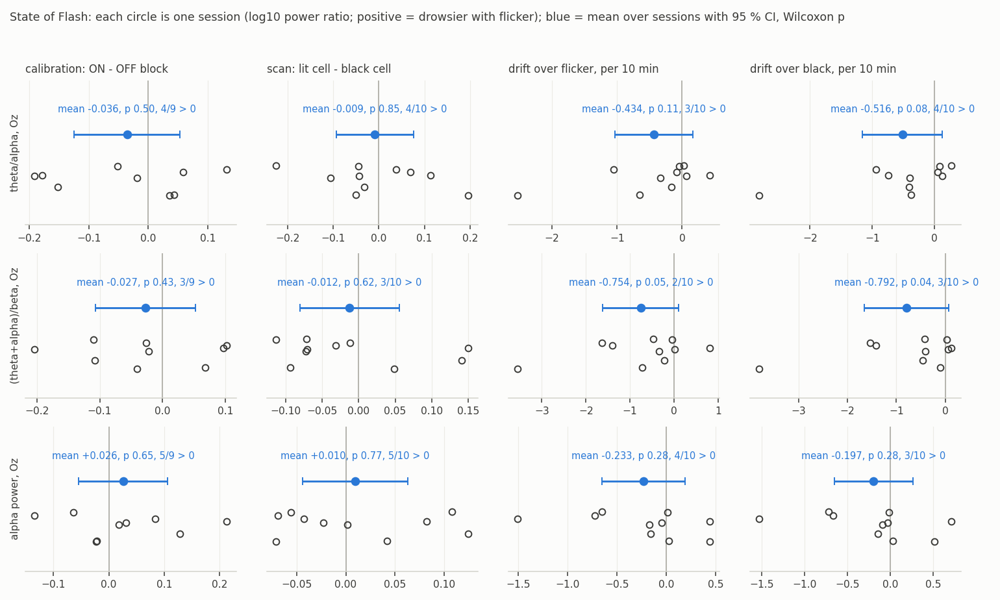
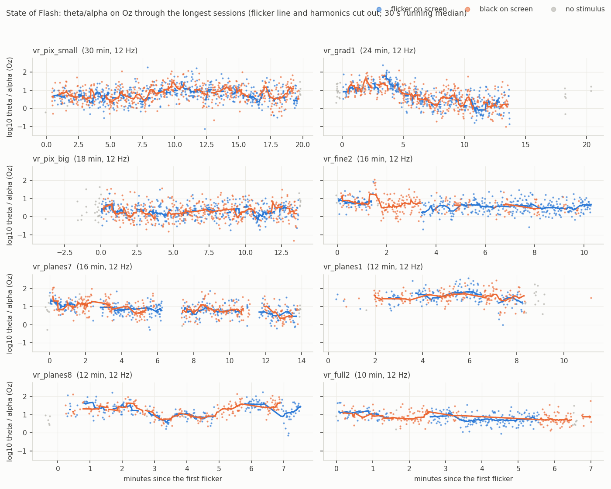

# State of Flash: does the flicker make you drowsy?

*Written 2026-10-07 from every session recorded so far. One subject, so every
pooled number below is over sessions of that one person, not over people.*

## The question

After the colour runs the subject reported that the flashing seemed to induce
drowsiness and help with sleep. Every recorded session is an unplanned
experiment on this: minutes of 12 Hz flicker interleaved, position by position
and block by block, with black. `analysis/state_of_flash.py` reads all of them
and asks the EEG three questions, with the flicker line, its harmonics and its
subharmonic cut out of every band first (a 12 Hz stimulus and its 6 Hz
subharmonic sit inside the alpha and theta bands, and would otherwise be read as
"drowsiness").

| question | how it is asked |
|---|---|
| **acute** | inside a session, is the EEG drowsier while a cell flickers than while a black cell is shown seconds before or after? Each flicker epoch is paired with the nearest black epoch within 45 s, so time on task is the same for both. Reported for the calibration blocks (ON and OFF strictly alternate, 8 s each) and for the scans (lit and black cells in serpentine order). |
| **drift** | does the marker climb with minutes of stimulation? Theil-Sen slope per session, over flicker epochs and over black epochs separately. If flicker itself were sedating, the slope over flicker would exceed the slope over black. |
| **net** | the minute before the first flicker against the minute after the last. (No session had a clean enough minute on both sides: the "before" minute is the headset going on.) |

Markers per 2 s epoch after a 1 to 40 Hz band-pass, on Oz (the aux electrode) and on the ears (TP9, TP10): log10 theta/alpha (4 to 7.5 Hz over 8 to 10.5 Hz), log10 (theta + alpha)/beta (beta 15 to 23 and 25 to 30 Hz), log10 alpha power. Eye closure as the share of time with Oz alpha above three times the eyes-open baseline for a second or more. Epochs over 150 uV on the channel group or more than 20 % blink are left out. Thirteen sessions have an Oz channel and a known flicker frequency; nine or ten contribute to each test.

## What the EEG says

**Acute: no.** With flicker on screen the EEG is not drowsier than with black on screen seconds away. On Oz, theta/alpha in the calibration blocks is -0.04 (95 % CI -0.13 to +0.05, p 0.50) and in the scans -0.01 (-0.09 to +0.08, p 0.85); (theta + alpha)/beta and alpha power are flat as well. The one effect that reaches p < 0.05 goes the other way: on the ears, theta/alpha is *lower* during the calibration ON blocks (-0.12, CI -0.24 to -0.01, p 0.049, 2 of 10 sessions positive). That is either the photic response spreading into the alpha band or a bright flashing field being mildly alerting; it is not a sign of drowsiness.

**Drift: present, but not from the flicker.** Oz theta/alpha falls through a session: -0.43 per 10 min over flicker epochs (p 0.11) and -0.52 over black epochs (p 0.08); (theta + alpha)/beta on Oz falls by -0.75 and -0.79 per 10 min (p 0.049 and 0.037). The slope is the same whether a cell is flashing or not, so it is time, not flicker. The ears show no such drift (-0.06 and -0.09 per 10 min, p 0.28 and 0.38), and a fall of half a log unit in ten minutes is far too large for a brain state; it has the signature of the wet Oz electrode settling after it is put on (less low-frequency noise, so less "theta"). The direction is also the opposite of drowsiness.

**Eye closure: no difference.** The share of time with closed-eye alpha on Oz is the same with flicker and with black (-0.03, p 0.13).

**Blinks: not measurable.** Under the headset the forehead electrodes AF7 and AF8 are essentially flat (99.9th percentile under 50 uV in the blink band, no blinks at any threshold inside sessions), so blink rate and slow eye movements, the best EEG-side markers of sleepiness, are not available from these recordings.

Numbers per session and pooled: `runs/state_of_flash/state_of_flash.json` (regenerated by the script; `runs/` is not in the repository).

## What this does and does not show

The recordings contain no EEG sign that the 12 Hz flicker makes the subject drowsier, acutely or over a session, on the markers the Muse can measure under the headset. They cannot refute the report either:

- There is no subjective rating (no sleepiness scale before and after), no reaction-time test, and no sleep measure after the session; the EEG markers here are proxies, and the frontal channels needed for the better ocular markers are dead under the headset.
- There is no control session of the same length without flicker. The audio-only session (`vr_music_cz1`) is the nearest thing and is too short on its own.
- Every session was at night, several of them around 2 am, when sleep pressure is high regardless of what is on the screen; what the subject felt afterwards may be the hour and twenty minutes of fixating a dot.
- Drowsiness after a session, rather than during it, is not something a within-session contrast can see.
- One subject.

## What is known about flicker near the alpha rhythm

Flicker at 10 Hz is the classic probe of the alpha rhythm. Stimulating from 1
to 100 Hz, Herrmann's group found the EEG resonating most at 10, 20, 40 and
80 Hz, the 10 Hz resonance being tied to the mechanism of spontaneous alpha
([Frontiers in Human Neuroscience, 2016](https://www.frontiersin.org/journals/human-neuroscience/articles/10.3389/fnhum.2016.00413/pdf)),
and driving is strongest when the flicker sits close to a person's own alpha
frequency. What happens *after* the flicker is the part that matters for a
sleep claim: in 30 healthy volunteers, 10 Hz photic stimulation was followed by
a *decrease* of alpha power in about 70 % of them, modulated by how far the
flicker sat from each person's alpha frequency
([Uniform decrease of alpha global field power induced by intermittent photic stimulation](https://publikationen.ub.uni-frankfurt.de/opus4/frontdoor/index/index/year/2010/docId/20015)).
A drop in alpha after stimulation is not the signature of sleep onset (that is
alpha giving way to theta with slow eye movements), so the published
after-effect of alpha-band flicker does not by itself predict drowsiness; the
relaxation and sleep claims for audio-visual "entrainment" devices rest on much
weaker evidence. Two cautions follow for any flicker-for-sleep use: flicker
between about 3 and 30 Hz is the range that provokes photosensitive seizures in
susceptible people, and 12 Hz full-field flicker in a headset is exactly that
stimulus; and the alpha-suppression after-effect depends on the individual's
alpha frequency, so a sleep protocol would have to be tuned per person.

## A State of Flash study that could answer it

The stimulus page already does everything needed; what is missing is the design and two questions to the subject.

1. **Blocks, counterbalanced, same luminance.** Five minutes each of: full-field 12 Hz flicker (the calibration ON stimulus), static grey at the flicker's mean luminance, and black with the fixation dot. Order rotated across sessions; at least three sessions per order; daytime as well as night.
2. **A sleepiness rating before and after every block** (the Karolinska Sleepiness Scale, 1 to 9, asked on the page and answered with the controller) and **a two-minute reaction-time test** after each block (the page shows a dot at random intervals, the subject pulls the trigger; median reaction time and lapses over 500 ms are the standard objective sleepiness measure).
3. **The same EEG markers**, plus heart rate variability if the Muse's optical sensor is streamed, and the Oz electrode given five minutes to settle before the first block so the drift seen here is out of the way.
4. **A fourth, optional block** at a lower frequency (8 or 10 Hz, inside the subject's alpha band) and one at 40 Hz, since the claim in the entrainment literature is frequency-specific and the 12 Hz used for the pictures was chosen for the SSVEP, not for sleep.
5. **More than one person.** The effect, if there is one, is a claim about people, not about this subject's electrode.

Three sessions of that design take under an hour each and would turn "it seems to make me sleepy" into a number with an interval around it.
